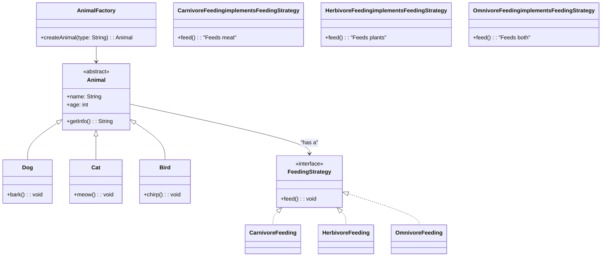
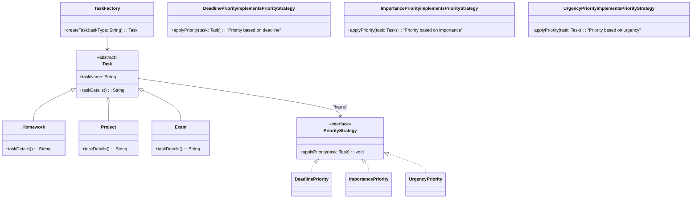

# IRUD-Assignment-1
# 🏡 Animal Shelter Management System  

## 📌 Overview  
An **Animal Shelter** manages different types of animals and their behaviors efficiently. The **Factory Method Pattern** helps create different animal types dynamically, while the **Strategy Pattern** allows flexible behavior changes such as feeding, exercise, and adoption processes.


## 🏗️ Design Patterns Applied  

1. **Factory Method Pattern**  
   - The shelter handles different types of animals (Dogs, Cats, Birds, etc.).  
   - Instead of hardcoding objects, a factory method (`AnimalFactory`) dynamically creates animals based on their type.  
   - This promotes **scalability** and **code reuse**.

2. **Strategy Pattern**  
   - Different animals have different behaviors (e.g., feeding methods, exercise routines, or medical care).  
   - Instead of using conditional logic, the shelter assigns behaviors dynamically using a **Strategy Pattern**.  
   - This allows easy modification of animal behaviors without changing core code.  

## 📌 UML Class Diagram  

Below is a UML representation of how the **Factory Method Pattern** and **Strategy Pattern** are implemented in the animal shelter system.



## 📌 Explanation of Implementation  

### 🏭 Factory Pattern  
The **Factory Method Pattern** is used to create different types of animals in the shelter dynamically. Instead of instantiating objects directly, we use an `AnimalFactory` that generates an instance of `Dog`, `Cat`, or `Bird` based on a given input. This ensures that adding new animal types in the future is easy and does not require modifying existing code.

**💡 Benefits:**
- Encapsulates object creation logic, making the system more modular.
- Easily extendable to support new animal types.
- Reduces tight coupling by allowing object creation through a single interface.

---

### 🎭 Strategy Pattern  
The **Strategy Pattern** is used to handle different feeding behaviors for animals. Instead of hardcoding feeding logic inside each `Animal` class, a `FeedingStrategy` interface defines different feeding behaviors (`CarnivoreFeeding`, `HerbivoreFeeding`, and `OmnivoreFeeding`). Each animal is assigned a feeding strategy based on its diet.

**💡 Benefits:**
- Allows dynamic selection of feeding behavior at runtime.
- Promotes code reusability by separating behavior from the `Animal` class.
- Makes it easy to modify feeding behavior without altering existing animal classes.

---

### 🔗 Combining Both Patterns  
- The **Factory Pattern** ensures that we can create various animals efficiently.
- The **Strategy Pattern** ensures that each animal can have a flexible feeding behavior.
- Together, they create a **scalable and maintainable** design for the animal shelter system.


###  **Discussion of Design Patterns Used**

####  **Strategy Pattern in Animal Feeding Behavior**

The **Strategy Pattern** allows the dynamic change of an animal’s feeding behavior. Instead of defining feeding logic within each animal class, a `FeedingStrategy` interface is implemented by various strategies (Carnivore, Herbivore, Omnivore). Each animal can change its feeding behavior at runtime by setting a new strategy, making the design flexible and easy to extend.

#### **Factory Pattern in Animal and Feeding Strategy Creation**

The **Factory Pattern** is used to handle the creation of different animal types and their respective feeding strategies. The `AnimalFactory` is responsible for creating objects based on the animal type and feeding strategy. This abstracts the object creation process and promotes code reusability, as new animals or strategies can be easily added without modifying the existing codebase.

This combination of patterns ensures that the system is scalable and adheres to the **Open/Closed Principle**, allowing new behaviors and animal types to be added without modifying existing code.

###  **C# Implementation of the Animal Shelter System**

### Factory Pattern Implementation (Animal and Feeding Strategy Factory)
```csharp
// Animal Factory
public class AnimalFactory
{
    public static Animal CreateAnimal(string type)
    {
        switch (type.ToLower())
        {
            case "dog": return new Dog();
            case "cat": return new Cat();
            case "bird": return new Bird();
            default: throw new ArgumentException("Invalid animal type.");
        }
    }
}

// Feeding Strategy Factory
public class FeedingStrategyFactory
{
    public static IFeedingStrategy CreateFeedingStrategy(string type)
    {
        switch (type.ToLower())
        {
            case "carnivore": return new CarnivoreFeeding();
            case "herbivore": return new HerbivoreFeeding();
            case "omnivore": return new OmnivoreFeeding();
            default: throw new ArgumentException("Invalid feeding strategy type.");
        }
    }
}
```

####  **Strategy Pattern Implementation (Feeding Behavior)**
```csharp
// Feeding Strategy Interface
public interface IFeedingStrategy
{
    void Feed();
}

// Concrete Feeding Strategies
public class CarnivoreFeeding : IFeedingStrategy
{
    public void Feed()
    {
        Console.WriteLine("Feeding meat to the animal.");
    }
}

public class HerbivoreFeeding : IFeedingStrategy
{
    public void Feed()
    {
        Console.WriteLine("Feeding plants to the animal.");
    }
}

public class OmnivoreFeeding : IFeedingStrategy
{
    public void Feed()
    {
        Console.WriteLine("Feeding a mix of plants and meat to the animal.");
    }
}

```
### Animal Base class and subclasses
```csharp
// Abstract Animal Class
public abstract class Animal
{
    protected IFeedingStrategy feedingStrategy;

    public void SetFeedingStrategy(IFeedingStrategy strategy)
    {
        feedingStrategy = strategy;
    }

    public void Feed()
    {
        if (feedingStrategy != null)
        {
            feedingStrategy.Feed();
        }
        else
        {
            Console.WriteLine("No feeding strategy set.");
        }
    }
}

// Concrete Animal Subclasses
public class Dog : Animal
{
    public Dog()
    {
        feedingStrategy = new CarnivoreFeeding();
    }
}

public class Cat : Animal
{
    public Cat()
    {
        feedingStrategy = new CarnivoreFeeding();
    }
}

public class Bird : Animal
{
    public Bird()
    {
        feedingStrategy = new HerbivoreFeeding();
    }
}
```


###  Demonstration of Usage
```csharp
class Program
{
    static void Main()
    {
        // Create animals using the factory
        Animal dog = AnimalFactory.CreateAnimal("dog");
        Animal bird = AnimalFactory.CreateAnimal("bird");

        // Feeding behavior before changing strategy
        Console.WriteLine("Feeding Dog:");
        dog.Feed();

        Console.WriteLine("Feeding Bird:");
        bird.Feed();

        // Changing feeding strategy at runtime
        Console.WriteLine("Changing Bird's feeding strategy to Omnivore...");
        bird.SetFeedingStrategy(new OmnivoreFeeding());
        bird.Feed();
    }
}
```


================================================================================================================================================================================================================================================================================

## 📌 Overview

In a **Student Task Management System**, students can manage their assignments, projects, deadlines, and other academic tasks. The system provides features such as creating tasks, assigning deadlines, setting priorities, and marking tasks as completed. The system helps students organize their work, stay on track with deadlines, and prioritize tasks based on urgency or importance.

### Features:
- **Task Creation**: Students can create tasks with descriptions, deadlines, and priorities.
- **Task Prioritization**: Tasks can be prioritized using different strategies (e.g., by deadline, by importance).
- **Task Completion**: Students can mark tasks as completed once they are finished.

This system is designed to be flexible and easy to use, allowing students to efficiently manage their workload.

## 🏗️ Design Patterns Applied

In this **Student Task Management System**, we will apply the **Factory** and **Strategy** design patterns to handle different types of tasks and prioritization strategies effectively.

1. **Factory Pattern**: 
   - The Factory pattern is used to create different types of tasks (e.g., Homework, Project, Exam) based on the user’s selection. It abstracts the task creation process and allows the system to easily extend with new task types in the future without modifying the core logic.
   
2. **Strategy Pattern**:
   - The Strategy pattern is applied to task prioritization. It allows students to choose different strategies for prioritizing their tasks (e.g., by deadline, by importance, or by urgency). This pattern allows flexibility in how tasks are prioritized without changing the structure of the task management system.



## 📌 Explanation of Implementation  

### 🏭 Factory Pattern  
The **Factory Method Pattern** is used to create different types of tasks in the student task management system dynamically. Instead of instantiating task objects directly, we use a `TaskFactory` that generates instances of `Homework`, `Project`, or `Exam` tasks based on the input type. This makes the system flexible and allows for easy addition of new task types without changing existing code.

**💡 Benefits:**
- Encapsulates the object creation logic, ensuring that the system is more modular and scalable.
- Makes it easy to add new task types without modifying the existing codebase.
- Reduces tight coupling by centralizing task creation in one class.

### 🎯 Strategy Pattern  
The **Strategy Pattern** is applied to calculate the priority for each task dynamically. Each task (e.g., `Homework`, `Project`, `Exam`) has a `PriorityStrategy` interface, with multiple implementations such as `UrgentPriority`, `MediumPriority`, and `LowPriority`. By using the Strategy pattern, we can easily switch priority calculation methods for different tasks without modifying the core logic of the task classes.

**💡 Benefits:**
- Allows changing the priority calculation logic dynamically based on the task type.
- Makes it easy to introduce new priority strategies without altering the task classes.
- Decouples the priority calculation from the task object, making the system more maintainable.

## 🔗 Combining Both Patterns

In this student task management system, both the **Factory Pattern** and the **Strategy Pattern** work together to handle the creation of tasks and their respective priority calculation methods:

- The **Factory Pattern** allows for the dynamic creation of task types (like `Homework`, `Project`, and `Exam`) based on the input type.
- The **Strategy Pattern** ensures that each task has its own flexible priority calculation logic (such as `UrgentPriority`, `MediumPriority`, and `LowPriority`), which can be changed at runtime depending on the task type.

The **Factory Pattern** handles object creation, while the **Strategy Pattern** provides the ability to change behavior at runtime. Together, they offer a clean, modular, and easily extendable design for managing tasks and their priorities.

### 📈 Why Combine These Patterns?
Combining these patterns allows us to:
- **Add new task types** or **priority strategies** easily.
- Keep the task management system **flexible**, without changing existing classes.
- Make the codebase **modular**, so each part of the system can evolve independently.

This combination results in a highly maintainable and scalable task management system that can handle both diverse tasks and dynamic behavior changes.

## 💻 C# Implementation of the System

### Factory Pattern Implementation

```csharp
using System;

public abstract class Task
{
    public string Name { get; set; }
    public DateTime DueDate { get; set; }

    public abstract void CalculatePriority();
}

public class Homework : Task
{
    public override void CalculatePriority()
    {
        Console.WriteLine("Calculating priority for Homework.");
    }
}

public class Project : Task
{
    public override void CalculatePriority()
    {
        Console.WriteLine("Calculating priority for Project.");
    }
}

public class Exam : Task
{
    public override void CalculatePriority()
    {
        Console.WriteLine("Calculating priority for Exam.");
    }
}

public class TaskFactory
{
    public static Task CreateTask(string taskType)
    {
        if (taskType == "Homework")
            return new Homework();
        if (taskType == "Project")
            return new Project();
        if (taskType == "Exam")
            return new Exam();

        throw new ArgumentException("Invalid task type");
    }
}
```

### Strategy Pattern Implementation
```csharp
public interface IPriorityStrategy
{
    void CalculatePriority(Task task);
}

public class UrgentPriority : IPriorityStrategy
{
    public void CalculatePriority(Task task)
    {
        Console.WriteLine($"Urgent priority for {task.Name}");
    }
}

public class MediumPriority : IPriorityStrategy
{
    public void CalculatePriority(Task task)
    {
        Console.WriteLine($"Medium priority for {task.Name}");
    }
}

public class LowPriority : IPriorityStrategy
{
    public void CalculatePriority(Task task)
    {
        Console.WriteLine($"Low priority for {task.Name}");
    }
}

public class TaskManager
{
    public Task Task { get; set; }
    public IPriorityStrategy PriorityStrategy { get; set; }

    public TaskManager(Task task, IPriorityStrategy priorityStrategy)
    {
        Task = task;
        PriorityStrategy = priorityStrategy;
    }

    public void AssignPriority()
    {
        PriorityStrategy.CalculatePriority(Task);
    }
}
```
### Program CS implementation
```csharp
public class Program
{
    public static void Main(string[] args)
    {
        Task task1 = TaskFactory.CreateTask("Homework");
        task1.Name = "Math Homework";
        task1.DueDate = DateTime.Now.AddDays(2);

        TaskManager taskManager1 = new TaskManager(task1, new UrgentPriority());
        taskManager1.AssignPriority();  // Output: Urgent priority for Math Homework

        Task task2 = TaskFactory.CreateTask("Project");
        task2.Name = "Science Project";
        task2.DueDate = DateTime.Now.AddDays(5);

        TaskManager taskManager2 = new TaskManager(task2, new MediumPriority());
        taskManager2.AssignPriority();  // Output: Medium priority for Science Project
    }
}
```


